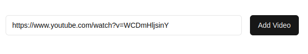
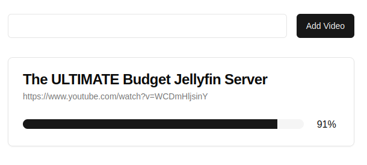
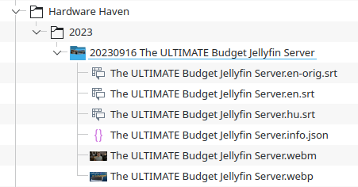
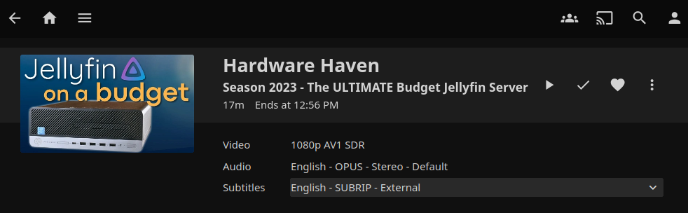

# ytdl

Simple YouTube video downloader for Jellyfin.

(docs somewhat outdated. I added a queue system which is not yet documented.)

## Usage

The app looks like this: an input field and a button.



Insert a YouTube URL and click "Add Video". Download will start and show real-time progress.



Concurrent downloads are supported. You can add multiple videos and they will download in parallel.

The videos are downloaded into a `data/videos` folder. The files are arranged in the following structure:



Jellyfin picks up the downloaded files and shows the video in the library.



I host this on my Raspberry Pi.

## Build

```bash
npm run build
```

```bash
podman build -t ddanielgal/ytdl --platform linux/arm64/v8 .
```

```bash
podman push ddanielgal/ytdl
```

```bash
podman build -f Dockerfile.worker -t ddanielgal/ytdl-worker --platform linux/arm64/v8 .
```

```bash
podman push ddanielgal/ytdl-worker
```

## Testing (containerized)

Verify the app can download a video end-to-end (server + worker + redis in containers):

```bash
# 1. Build the image
podman build -t localhost/ytdl:latest .

# 2. Run redis, app, and worker in one pod. Ports are published so the
#    API is reachable on localhost:3000.
podman create --pod new:ytdl -p 3000:3000 -p 6379:6379 \
  --name redis docker.io/redis:7-alpine
podman create --pod ytdl --name ytdl-app \
  --env YTDLP_PATH=/usr/local/bin/yt-dlp \
  --env YTDLP_COOKIES_PATH=/etc/ytdl/cookies.txt \
  --env REDIS_HOST=localhost --env REDIS_PORT=6379 \
  localhost/ytdl:latest
podman create --pod ytdl --name ytdl-worker \
  --env YTDLP_PATH=/usr/local/bin/yt-dlp \
  --env YTDLP_COOKIES_PATH=/etc/ytdl/cookies.txt \
  --env REDIS_HOST=localhost --env REDIS_PORT=6379 \
  -v "$(pwd)/cookies.txt:/etc/ytdl/cookies.txt" \
  -v "$(pwd)/data:/app/data" \
  localhost/ytdl:latest bun run src/worker/worker.ts
podman start redis ytdl-app ytdl-worker

# 3. Queue a download via the tRPC API
curl -X POST localhost:3000/api/trpc/addVideo \
  -H 'content-type: application/json' \
  -d '{"url":"https://www.youtube.com/watch?v=kKAue9DiHc0"}'

# 4. Watch the worker, then confirm output under data/videos/
podman logs -f ytdl-worker
find data/videos -type f
```

## Next up

- [x] Instant queueing
- [ ] Cronjob channel auto-queuer
