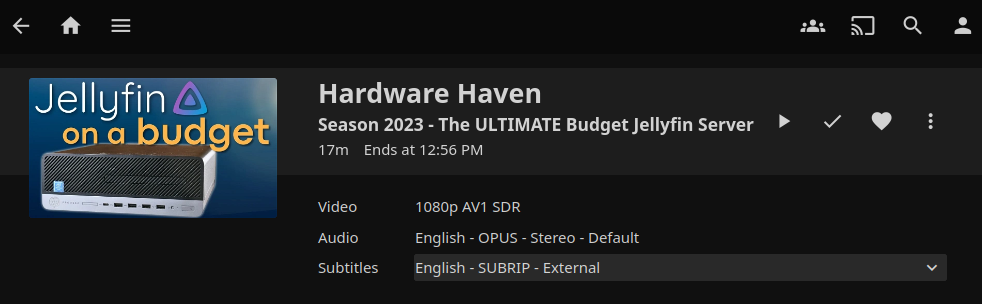

# ytdl

Simple YouTube video downloader for Jellyfin.

(docs somewhat outdated. I added a queue system which is not yet documented.)

## Usage

The app looks like this: an input field and a button.


Insert a YouTube URL and click "Add Video". Download will start and show real-time progress.


Concurrent downloads are supported. You can add multiple videos and they will download in parallel.

The videos are downloaded into a `data/videos` folder. The files are arranged in the following structure:


Jellyfin picks up the downloaded files and shows the video in the library.



I host this on my Raspberry Pi.

## Build

```bash
npm run build
```

```bash
podman build -t ddanielgal/ytdl --platform linux/arm64/v8 .
```

```bash
podman push ddanielgal/ytdl
```

## Next up

- Instant queueing
- Cronjob channel auto-queuer
